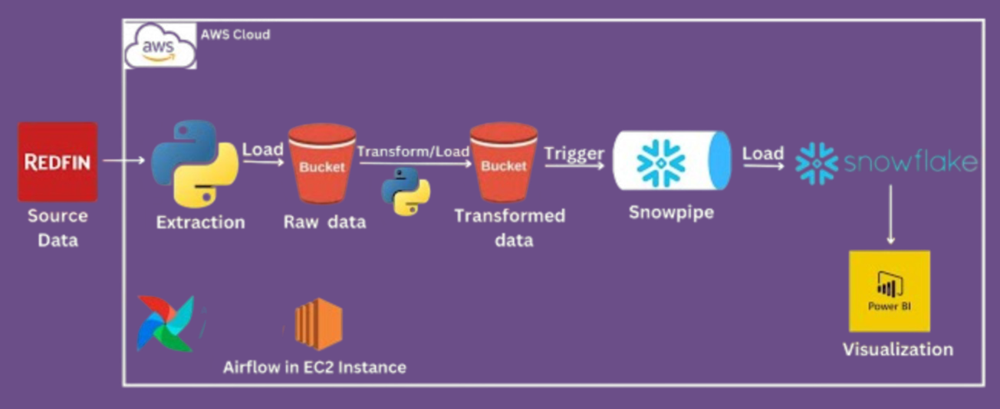
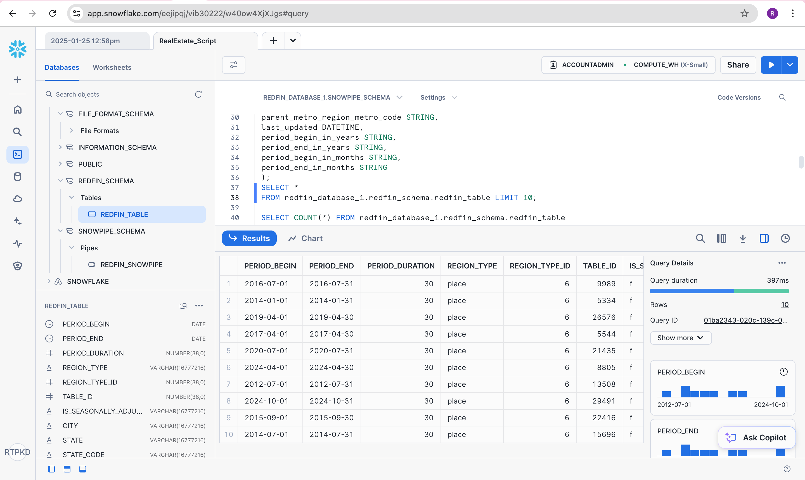

---

### Real Estate Data Analytics - ETL Data Engineering Project



This project demonstrates an end-to-end ETL (Extract, Transform, Load) data engineering pipeline for Redfin real estate data. The pipeline utilizes **Apache Airflow, AWS (S3, EC2), Snowflake, Snowpipe, and Power BI** to extract, transform, and visualize real estate insights.

---

## Technologies Used
- **Python** - Data extraction and transformation
- **Pandas** - Data manipulation and transformation
- **Apache Airflow** - Orchestration and automation
- **Amazon S3** - Cloud storage for raw and transformed data
- **Amazon EC2** - Hosting Airflow
- **Snowflake** - Cloud data warehouse
- **Snowpipe** - Automating data ingestion into Snowflake
- **Power BI** - Data visualization

---

## Project Workflow
1. **Extract Data**  
   - Connect to Redfin data center and extract real estate data using Python.

2. **Transform Data**  
   - Clean and process data using Pandas.

3. **Load Data to AWS S3**  
   - Store both raw and transformed data in Amazon S3.

4. **Trigger Snowpipe for Automated Ingestion**  
   - Snowpipe detects new data and loads it into Snowflake.

5. **Data Warehouse Storage (Snowflake)**  
   - Data is structured and stored in Snowflake tables.

6. **Visualization (Power BI)**  
   - Connect Power BI to Snowflake and create dashboards for insights.

7. **Orchestration with Apache Airflow**  
   - Use Airflow to automate and schedule the entire ETL pipeline.

---



## Setup & Installation
### 1. Clone the Repository
```bash
git clone https://github.com/your-username/redfin-etl-project.git
cd redfin-etl-project
```

### 2. Install Dependencies
```bash
pip install -r requirements.txt
```

### 3. Configure AWS & Snowflake
- Set up **AWS S3** for storage.
- Configure **Snowflake** credentials.
- Enable **Snowpipe** for automatic ingestion.

### **4. Deploy Apache Airflow on EC2**
- Install **Apache Airflow** on an EC2 instance and configure DAGs.

---

## **Project Structure**
```
📂 redfin-etl-project
│── 📂 dags              # Apache Airflow DAGs
│── 📂 scripts           # Python scripts for extraction & transformation
│── 📂 config            # Configuration files
│── 📂 data              # Sample data files
│── 📄 requirements.txt  # Project dependencies
│── 📄 README.md         # Project documentation
```


